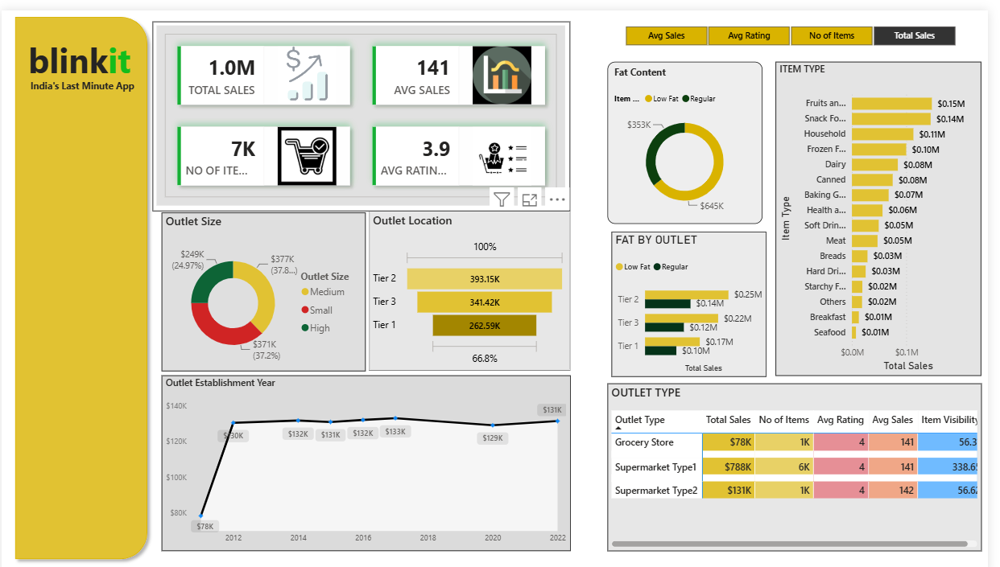

# Blinkit-Sales-Dashboard
Interactive Blinkit sales dashboard created using Microsoft power Bi to analyze Blinkit's sales performance and business insights.
## Tools Used
Microsoft power Bi
Power Query
DAX 
Data Visualization
## Dashboard Features
Total Sales
Average Sales
No of Items
Average Rating
Sales by Outlet
Sales by Item Category
Interactive Slicers and Filters
## Key Insights
Analyzed Overall Sales Performance.
Compared Sales Across Different Outlet Types.
Analyzed Item Categories  and their Contribution to Sales.
Used Interactive Filters for Better Analysis.
## Dashboard Preview

